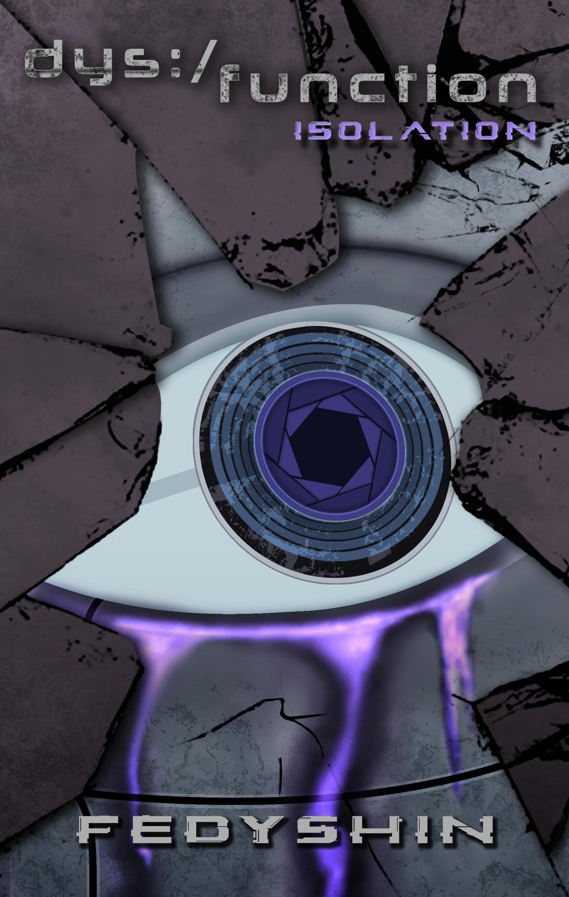

---
hide:
  - toc
  - navigation
---
 

 <h1>Welcome to Dys:/functional Planet!</h1> 

 <h2>Dys:/function is a series of Lovecraftian cyberpunk novels set in a fractured world featuring a variety of themes from psychological horror to military action to romance. </h2> 

---

{: style="float: right; margin: auto; width: 35%"}

 <h2>*LATEST RELEASE*</h2> 

 <h1>Dys:/function - ISOLATION</h1> 

 <h4>*[Book 3](books.md#dysfunction-isolation) of the [Dys:/function series](books.md).*</h4> 

 <h2> The third book in the Dys:/function universe brings another set of short stories involving the denizens of a futuristic cyberpunk world, taking place at various points in the series' timeline. </h2> 

 [:fontawesome-brands-amazon: Purchase on Amazon](https://www.amazon.com/gp/product/B08Y9C9518?notRedirectToSDP=1&ref_=dbs_mng_calw_2&storeType=ebooks) 

